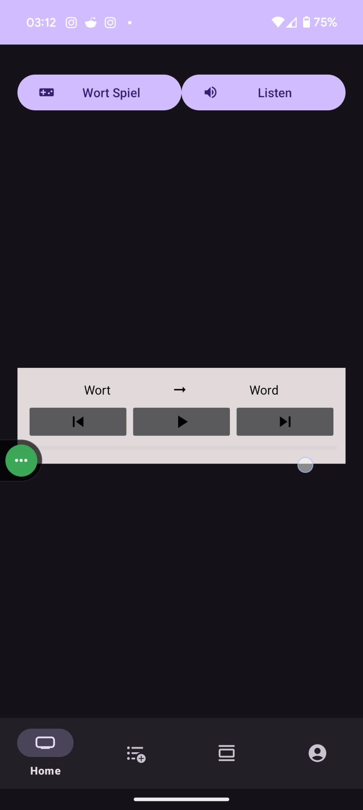
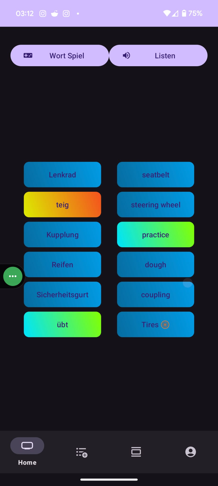
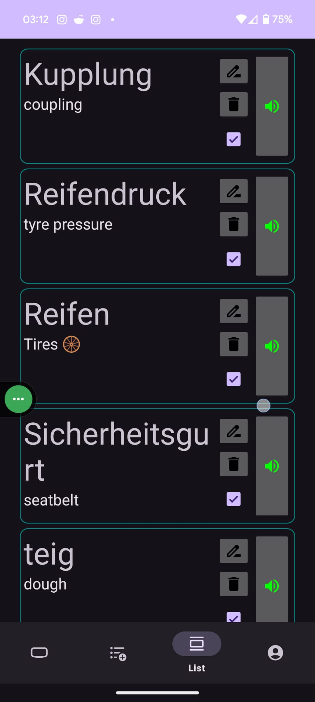
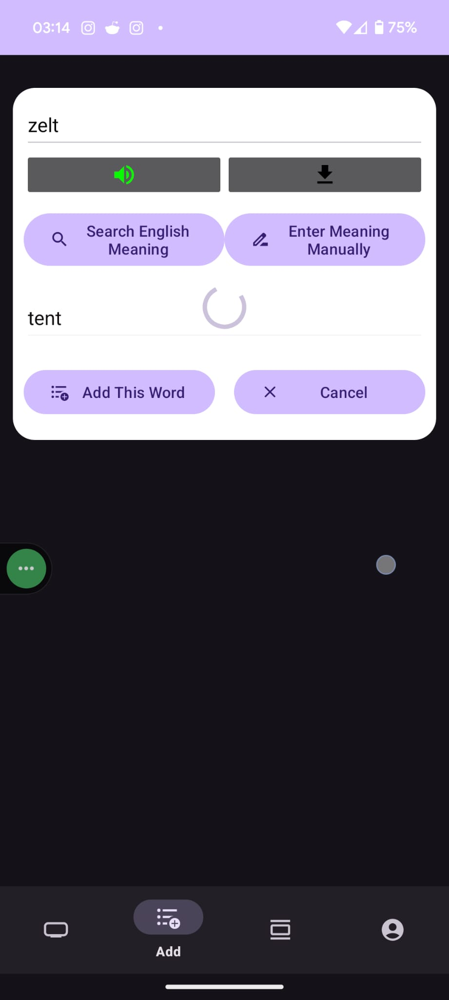

# [Wort-Gewandt](https://nazmos-sakib.github.io/Wort-Gewandt/) Android App  📱
<a href="https://nazmos-sakib.github.io/Wort-Gewandt/"></a> <a href="https://play.google.com/store/apps/details?id=com.wortgewandt&pli=1"></a>


# Project Description

Welcome to Wort-Gewandt, your ultimate companion for mastering German vocabulary effortlessly! Say goodbye to traditional flashcards and hello to a dynamic learning experience. With our innovative app, you can effortlessly store and learn new German words with ease.
Our app automatically fetches English meanings and pronunciations for each German word, ensuring accurate and comprehensive understanding. But that's not all – we've taken learning a step further with an engaging word game. Challenge yourself as you match German words with their meanings in a randomly sorted array, making memorization a breeze.
Need extra practice on pronunciation? No problem! Our app allows you to listen to word pronunciations continuously, honing your auditory skills.
Join countless learners who have already revolutionized their German learning journey with Wort-Gewandt,. Download now and embark on a fun-filled adventure to fluency!      
<br/>


<br/>
<br/>


***
# What I have learned 👍 

* **`MultiThreading & Asynchronous Tasks`**: Mastered concurrent programming to enhance app performance.
* **`Local Storage Solutions`**: Efficiently stored data locally for offline access.
* **`Shared Preferences`**: Implemented shared preferences for persistent user settings.
* **`Accessing Cache Files`**: Leveraged cache files to optimize data retrieval and storage.
* **`Creating Temporary Raw Files`**: Generated and managed temporary raw files for transient data.
* **`Web Scraping`**: Extracted and parsed web data using sophisticated techniques.
* **`Downloading Web Content with Volley`**: Utilized the Volley library for robust network operations.
* **`Jsoup Library Expertise`**: Proficiently parsed HTML content using the Jsoup library.
* **`File Downloading with` _`Apache`_ `Library`**: Seamlessly downloaded files with the Apache Commons library.
* **`Online & Local Audio Playback`**: Played audio from online URLs and raw files with ease.
* **`Data Object to File Conversion`**: Converted data objects to file objects and saved them in local storage.
* **`Dynamic View Manipulation`**: Crafted responsive and interactive UI components dynamically.


***
# Features

- **Save Word**: Add new German words to your vocabulary list and use in games.
- **Search for English Meaning**: Automatically search or manually insert the English meaning of the German word.
- **Download Pronunciation**: Download and save the pronunciation of the word.
- **View Saved Words**: Access all the words you have saved in a convenient list.
- **Read and Play Audio**: Read the saved words and listen to their pronunciations.
- **Include/Exclude Words from Word Game**: Check or uncheck words to include or exclude them from the word game.
- **Edit and Delete Words**: Edit or delete words as needed to keep your list up to date.
- **Play Pronunciations**: Listen to the pronunciation of all selected words.
- **Word Game**:
  - **Random Word Matching Game**: Six random words with their meanings are shown in random order.
  - **Match Words with Meanings**: Match each word with its correct meaning.
  - **New Words After Each Game**: A new set of six words appears after completing a match.


***
# How to Use
- Insert new word in **`Add`** Fragment
   - Insert **`a German Word`**
   - Search for **`English meaning`** or can **`manualy`** insert the meaning
   - User can also **`Download Pronunciation`** and save it with the word
   - **`Save`* word to play word game
- **List View**: View all the saved words.
  - **`Read`** saved words and **`play audio`**.
  - if user does not want to include a word to **`Word Game`**, user can **`uncheck`** the word.
  - **`Edit`** and **`Delete`** a Word is necessery
- In **`Home`** Fragment:
  -  **`Play pronunciation`** of all the selected words
  -  Play **`Word Game`**
     - Six random word with their meaning will beshown in random order.
     - User have to **`match`** word with their meaning
     - after finishing matching, new six word will appear

***
# Screenshots 
<p align="center">
  
  
  
  
</p>

***
# App ratings 


<br>

***
# Installation
1. Clone the repository
   ```
   git clone https://github.com/nazmos-sakib/Wort-Gewandt.git
   ```
2. Open the project in Android Studio
3. Build the project and run it on an emulator or physical device

***
# Requirements

### Software
- **Android Studio** Android Studio Hedgehog | 2023.1.1
- **Android SDK** 26 or higher
- **Build Tools Version** 34
- **Gradle.kts Version** gradle-8.2
- **Java Version**: 17

### Libraries
- **Serialize MultiMap**: `implementation ("com.google.collections:google-collections:1.0-rc2")`
- **Apache Aile Download**: `implementation ("commons-io:commons-io:2.16.1")`
- **jsoup**: `implementation ("org.jsoup:jsoup:1.17.2")`
- **volley**: `implementation("com.android.volley:volley:1.2.1")`
  
### Permissions
- `android.permission.INTERNET`
- `android.permission.ACCESS_NETWORK_STATE`

***
# License
This project is licensed under the MIT License - see the [LICENSE](LICENSE) file for details.
